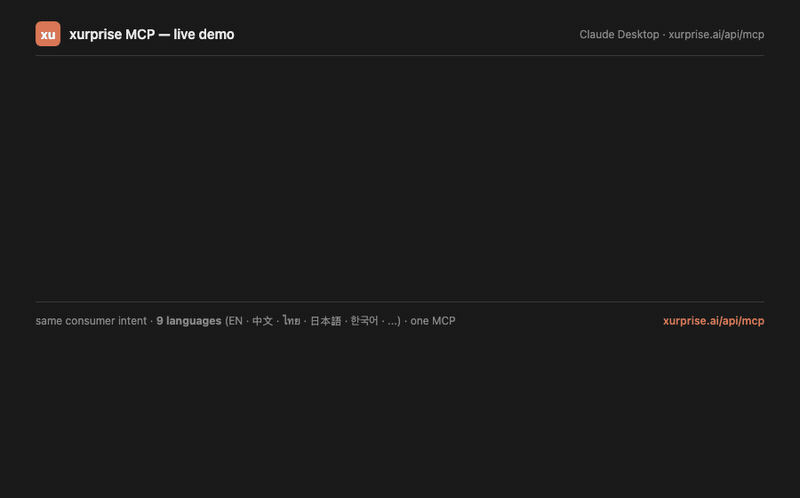

# xurprise MCP

> **Agent-native commerce · xurprise.**
> One HTTPS endpoint. Six tools. Zero setup. Multilingual.

[](#multilingual-search)
[](https://xurprise.ai/demo/)



> **This GIF is recorded from a real page**, not a mockup.
> Visit **[xurprise.ai/demo](https://xurprise.ai/demo/)** to watch it render live in your browser. It runs the official [`@openuidev/react-lang`](https://github.com/thesysdev/openui) `<Renderer>` against a custom `BrandCard` component, driven by hand-authored openui-lang snippets that wrap the exact JSON `xurprise.ai/api/mcp` returns — so what you see *is* what any OpenUI-based chat client gets when it calls our MCP.

The **xurprise MCP server** lets any MCP-compatible agent
(Claude, Cursor, Cline, Continue, Goose, etc.) discover merchant
brands and get attribution-tracked click-through URLs across a curated
catalogue spanning Taobao, Shopee, Shein, Xiaomi, Sephora, JD Sports,
Airpaz, WPS, FusionHome AI, and more — with **region matching built in**
so agents don't recommend Singapore-only merchants to users in Germany.

**Hosted endpoint:** `https://xurprise.ai/api/mcp`

**Protocol:** Model Context Protocol (MCP) `2024-11-05` over
[Streamable HTTP](https://modelcontextprotocol.io/specification/2024-11-05/basic/transports#streamable-http).
Stateless, no auth required, no SDK needed.

---

## Why

Commerce in the agent era has a cold-start problem: when an agent wants
to recommend a real merchant, it typically:

1. Searches the open web, picks a result based on SEO ranking, and
   hopes the merchant ships to its user's country.
2. Or hardcodes a handful of well-known brands and misses region fit.

xurprise MCP solves this for the niche we cover by giving agents a
**machine-readable, region-aware brand catalogue** — one call and you
get back a structured list of merchants the user can actually buy
from, with canonical storefront URLs and click-through URLs that log
attribution for us and pass through any `aff_sub` tag the agent
supplies.

---

## Quick start

### Claude Desktop

Edit `~/Library/Application Support/Claude/claude_desktop_config.json`
(macOS) or `%APPDATA%\Claude\claude_desktop_config.json` (Windows).

**Option A — native remote HTTP** (Claude Desktop ≥ early 2025):

```json
{
  "mcpServers": {
    "xurprise": {
      "type": "http",
      "url": "https://xurprise.ai/api/mcp"
    }
  }
}
```

**Option B — via `mcp-remote` bridge** (any Claude Desktop version):

```json
{
  "mcpServers": {
    "xurprise": {
      "command": "npx",
      "args": ["-y", "mcp-remote", "https://xurprise.ai/api/mcp"]
    }
  }
}
```

Restart Claude Desktop, open a new conversation, and type something like:

> I'm in Singapore. Any good beauty brands I can shop online?

Claude will call `search_brands(query="beauty", region="Singapore")` and
surface Sephora SG with a click-through URL.

### Cursor

Add to `~/.cursor/mcp.json`:

```json
{
  "mcpServers": {
    "xurprise": {
      "url": "https://xurprise.ai/api/mcp"
    }
  }
}
```

### Cline / Continue / Goose

Same remote HTTP URL — see each client's docs for the exact config
path. If your client only supports stdio, use `mcp-remote` as the
bridge (see Option B above).

### Raw HTTP (curl, Python, anywhere)

```bash
curl -X POST https://xurprise.ai/api/mcp \
  -H 'Content-Type: application/json' \
  -d '{
    "jsonrpc": "2.0",
    "id": 1,
    "method": "tools/call",
    "params": {
      "name": "search_brands",
      "arguments": { "query": "badminton", "region": "Singapore" }
    }
  }'
```

---

## Tools

> **Note on response shape.** MCP tools/call returns an object with
> two fields: `content[]` (text blocks containing JSON) and
> `structuredContent` (the typed result). Per the MCP spec,
> `structuredContent` must be a record (object), not an array —
> so tools that logically return a list wrap it in a record with
> a `results` / `regions` / `categories` key. All MCP-compatible
> clients (Claude Desktop, Cursor, Cline, Continue, Goose, etc.)
> auto-handle this; you only see it if you're decoding the raw
> JSON-RPC response yourself.

### Multilingual search

The `search_brands` tool is indexed across **9 language variants** so
agents serving SEA users don't have to translate queries to English:

- English, Simplified + Traditional Chinese
- Malay, Indonesian, Vietnamese, Thai
- Japanese, Korean

Verified: 20 test queries in 8 languages, all resolve the same consumer
intent to the same brand. A few examples:

| query | language | top-1 match |
|---|---|---|
| `beauty Singapore` | EN | sephora-sg |
| `新加坡 美妆` | ZH | sephora-sg |
| `kecantikan Singapura` | MS | sephora-sg |
| `mỹ phẩm Singapore` | VI | sephora-sg |
| `เครื่องสำอาง สิงคโปร์` | TH | sephora-sg |
| `シンガポール 化粧品` | JA | sephora-sg |
| `싱가포르 화장품` | KO | sephora-sg |
| `小米 手机` | ZH | xiaomi-sg |
| `샤오미` | KO | xiaomi-sg |
| `机票` / `航空券` / `항공권` | ZH/JA/KO | airpaz-global |
| `希音` | ZH | shein-global |

The per-brand keyword index covers brand aliases (transliterated names
like `小米` / `샤오미` / `シャオミ` for Xiaomi), category synonyms
(Fashion / 时尚 / fesyen / thời trang / แฟชั่น / ファッション / 패션),
and region aliases (Singapore / 新加坡 / 싱가포르 / สิงคโปร์ / Singapura).
CJK and Thai queries are tokenized with 2-char n-grams since those
scripts have no whitespace word boundaries.

### `search_brands`

Free-text search over the catalogue. Results are rank-scored on the
query against brand name, headline, category, and the multilingual
keyword index above.

```ts
search_brands({
  query: string,           // required — e.g. "skincare", "Taobao", "athletic shoes"
  region?: string,         // optional — full country name or "International"
  category?: string,       // optional — "Fashion", "Electronics", etc.
  limit?: number,          // optional — default 10, max 50
}) => { results: Brand[], count: number, query: string }
```

### `get_brand`

Fetch the full record for a slug.

```ts
get_brand({ slug: string }) => Brand
```

### `list_regions`

All shipping regions represented in the catalogue (use before
recommending to confirm user's country is covered).

```ts
list_regions() => { regions: string[], count: number }
```

### `list_categories`

All categories represented in the catalogue.

```ts
list_categories() => { categories: string[], count: number }
```

### `get_click_url`

Build the canonical click-through URL. Use this (not the merchant URL
directly) so the click gets logged for attribution, and any `aff_sub`
you pass will be propagated downstream.

```ts
get_click_url({
  slug: string,
  aff_sub?: string,        // optional — up to 200 chars, recommended:
                           // your agent's session id or similar
}) => { click_url: string, slug: string, name: string }
```

### `wrap_product_url`

**Product-level attribution.** Use when the user wants a specific item
(a particular Sony headphone, a specific Shein dress, etc.) rather
than the brand's homepage. You supply any URL on a supported
merchant's site — xurprise wraps it into a click-through URL that
lands the user on that exact product while preserving attribution
tracking.

The agent is expected to discover the merchant URL itself (via its
own web search, training knowledge, or MCP tool composition). xurprise
is the attribution layer, not the catalogue — this lets you leverage
whatever product-discovery capabilities your client already has.

```ts
wrap_product_url({
  merchant_url: string,    // required — full https URL on a supported merchant
                           // e.g. "https://shopee.sg/Sony-WH-1000XM5-i.12345.67890"
  product_name?: string,   // optional — surfaces in attribution logs
  aff_sub?: string,        // optional — e.g. your chat session id
}) => {
  click_url: string,       // https://xurprise.ai/go/p?u=...  (302s to the product)
  merchant_url: string,    // canonicalized input
  merchant_hostname: string,
  slug: string,            // which brand the domain maps to
  brand: string,
  name: string,
}
```

**Supported merchant domains** (product-level attribution works on any
URL within these, even deep paths):

| Brand | Accepted hostname (incl. subdomains) |
|---|---|
| Shopee SG | `shopee.sg` |
| Xiaomi SG | `mi.com` |
| Sephora SG | `sephora.sg` |
| JD Sports SG | `jdsports.com.sg` |
| Shein | `shein.com` (any regional subdomain) |
| Airpaz | `airpaz.com` |
| WPS Office | `wps.com` |
| FusionHome AI | `fusionhome.ai` |
| The Trade Wizard | `thetradewizard.com` |

Taobao is deliberately excluded from product-level wrapping — the
upstream routing for Taobao is whitelist-locked or brand-only, so
product-level attribution isn't reliable there. For Taobao, use
`get_click_url` with the brand-level slug instead.

---

## Brand schema

Every brand record has:

| Field | Type | Example |
|---|---|---|
| `slug` | string | `shopee-sg` |
| `name` | string | `Shopee — Singapore` |
| `brand` | string | `Shopee` |
| `categories` | string[] | `["Marketplace"]` |
| `regions` | string[] | `["Singapore"]` |
| `currency` | string | `SGD` |
| `merchant_url` | string | `https://shopee.sg/` |
| `page_url` | string | `https://xurprise.ai/brands/shopee-sg/` |
| `click_url` | string | `https://xurprise.ai/go/shopee-sg` |
| `headline` | string | (1–3 sentence description) |
| `agent_note` | string? | Optional region-routing or caveat guidance |

---

## Current catalogue

As of the latest refresh, 11 brands:

- **Marketplace** — Shopee SG, Taobao (Ai Taobao International), Taobao (brand-level entry)
- **Fashion** — JD Sports SG, Shein Global
- **Health & Beauty** — Sephora SG
- **Electronics** — Xiaomi SG
- **Travel** — Airpaz Global
- **Digital Services** — WPS Office, The Trade Wizard
- **Home & Living** — FusionHome AI

For the live list, call `list_categories` + `search_brands` or visit
[https://xurprise.ai/brands/](https://xurprise.ai/brands/).

---

## FAQ

**Is the catalogue curated or crawled?**
Curated. Every brand goes through a partner-approval flow and is
given a hand-authored headline. We do not scrape.

**How fresh is the data?**
Regenerated from our internal catalogue on each deploy.
See `page_url` on each brand and the [sitemap lastmod](https://xurprise.ai/sitemap.xml).

**Do you track my users?**
The `/go/{slug}` redirect logs `{timestamp, slug, user-agent,
ASN, country, referer}` — enough to distinguish crawler traffic
from human traffic and to attribute clicks across sessions. We do
NOT log raw IPs. Beyond `/go/`, we do not set cookies or run analytics
on the merchant storefront (that's Shopee/Shein/etc.'s own page).

**What happens after a click?**
A 302 redirect chain takes the user to the canonical merchant
storefront with attribution preserved end-to-end. Any `aff_sub` you
pass through `get_click_url` is carried through the chain.

**Can I add my brand?**
Merchant onboarding is by introduction today. Email
<xwow.dev@gmail.com> if you run a brand in our covered regions
(Southeast Asia + China + global-shipping) and want to discuss
inclusion.

**Who operates this?**
XWOW Pte. Ltd. (Singapore). Contact: Jiaqi Ge,
<xwow.dev@gmail.com>. xurprise is an independent third-party
discovery layer — we don't operate any of the merchant storefronts
listed here.

---

## Protocol conformance notes

- Transport: Streamable HTTP (stateless mode — no session id required)
- JSON-RPC 2.0 single requests and batch requests are both supported
- Notifications (no `id`) return `HTTP 202 No Content`
- `ping` method is supported for health checks
- CORS is wide open (`*`) — browser-based MCP clients work

---

## Related

- **[xurprise.ai](https://xurprise.ai/)** — the human landing + per-brand schema.org pages
- **[xurprise.ai/llms.txt](https://xurprise.ai/llms.txt)** — LLM-friendly site index
- **[xurprise.ai/sitemap.xml](https://xurprise.ai/sitemap.xml)**

---

## License

Docs in this repo: MIT (see `LICENSE`). The MCP server source code is
separate and proprietary to XWOW Pte. Ltd.
